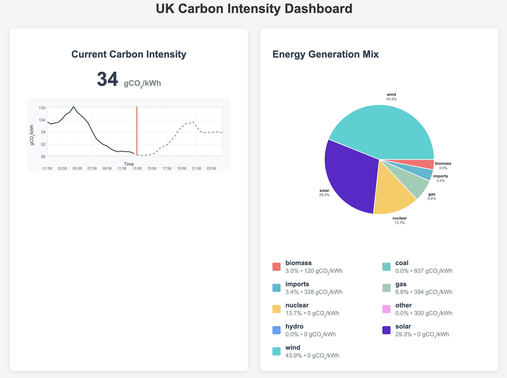

# Carbon Vibe 🌱

A comprehensive Rust toolkit for accessing and visualizing UK carbon intensity data from the [Carbon Intensity API](https://carbonintensity.org.uk/).

*This project was vibe coded using [Claude Code](https://claude.ai/code) - bringing AI-assisted development to life! 🤖✨*

## Overview

Carbon Vibe provides three complementary tools for understanding UK electricity carbon intensity:

- **CLI Tools**: Quick command-line access to current and historical data
- **Web Dashboard**: Interactive visualization with real-time charts and energy breakdown
- **Professional Graphs**: 24-hour intensity trends with proper axis labeling

## Features

### 🔌 CLI Tools

- **`current`**: Display current carbon intensity as a single value
- **`history`**: Show 12-hour historical data with hourly averages

### 🌐 Web Dashboard

- **Current Intensity Display**: Large, prominent current carbon intensity
- **24-Hour Graph**: Historical and forecast data with professional axis labels
- **Energy Mix Pie Chart**: Visual breakdown of electricity generation sources
- **Carbon Intensity Factors**: Environmental impact data for each energy source
- **Real-time Data**: Live updates from the Carbon Intensity API

### 📊 Visualizations

- **SVG-based Charts**: Scalable, professional-quality visualizations
- **Smart Labeling**: External pie chart labels and time-based axis markers
- **Responsive Design**: Clean, modern interface optimized for desktop viewing
- **Color-coded Legend**: Easy identification of energy sources and their carbon footprint

## Installation

### Prerequisites

- [Rust](https://rustup.rs/) (2024 edition)
- Internet connection for API access

### Build from Source

```bash
# Clone the repository
git clone <repository-url>
cd carbon-vibe

# Build all binaries
cargo build --release

# Or build individual tools
cargo build --release --bin current
cargo build --release --bin history  
cargo build --release --bin web
```

## Usage

### CLI Tools

#### Current Carbon Intensity
```bash
# Simple output
cargo run --bin current
# Output: 87

# With detailed logging
RUST_LOG=trace cargo run --bin current
```

#### 12-Hour History
```bash
# Hourly averages for last 12 hours
cargo run --bin history
# Output:
# 2025-06-25 20:00: 187
# 2025-06-25 21:00: 180
# ...
# 2025-06-26 07:00: 92
```

### Web Dashboard

```bash
# Start the web server
cargo run --bin web

# Access the dashboard
open http://127.0.0.1:3000
```

The web dashboard provides:
- **Current carbon intensity** with large, readable display
- **24-hour timeline graph** showing trends and forecasts
- **Energy generation pie chart** with external labels
- **Detailed legend** with carbon intensity factors for each source

### Screenshot



*The dashboard showing real-time UK carbon intensity data with 24-hour trends and energy source breakdown.*

## API Integration

Carbon Vibe integrates with multiple Carbon Intensity API endpoints:

- **Current Intensity**: `GET /intensity`
- **Historical Data**: `GET /intensity/{from}/{to}`  
- **Generation Mix**: `GET /generation`
- **Carbon Factors**: `GET /intensity/factors`

All API calls include proper error handling and graceful fallbacks.

## Technical Details

### Architecture

- **Language**: Rust 2024 Edition
- **Web Framework**: Axum with server-side rendering
- **HTTP Client**: reqwest with JSON support
- **Async Runtime**: Tokio
- **Logging**: tracing with environment-controlled levels
- **Date/Time**: chrono for parsing and formatting

### Data Processing

- **Historical Aggregation**: 30-minute API intervals combined into hourly averages
- **Timeline Analysis**: 48 data points over 24 hours (12h past + 12h future)
- **Smart Fallbacks**: actual → forecast → default values
- **Carbon Factor Mapping**: Intelligent matching between generation mix and intensity factors

### Code Quality

- **Zero Compile Warnings**: Clean build with Clippy
- **Named Parameters**: Self-documenting format strings
- **Error Handling**: Comprehensive Result types and graceful degradation
- **Modern Rust**: Following 2024 edition best practices

## Project Structure

```
carbon-vibe/
├── Cargo.toml              # Project configuration and dependencies
├── README.md               # This file
├── CLAUDE.md               # AI assistant context documentation
├── DEVELOPMENT_LOG.md      # Detailed development session log
└── src/
    └── bin/
        ├── current.rs      # Current intensity CLI
        ├── history.rs      # Historical data CLI
        └── web.rs          # Web dashboard server
```


## Development

### Running Tests

```bash
cargo test
```

### Code Formatting

```bash
cargo fmt
```

### Linting

```bash
cargo clippy
```

### Trace Logging

Enable detailed API logging for debugging:

```bash
RUST_LOG=trace cargo run --bin <binary_name>
```

## Contributing

1. Fork the repository
2. Create a feature branch
3. Make your changes
4. Ensure all tests pass and code is formatted
5. Submit a pull request

## License

[Add your license here]

## Acknowledgments

- [Carbon Intensity API](https://carbonintensity.org.uk/) for providing free access to UK electricity carbon data
- UK National Grid ESO for carbon intensity calculations and forecasts

---

*Carbon Vibe helps you understand the environmental impact of UK electricity consumption through clear visualizations and easy-to-use tools.* 🌱